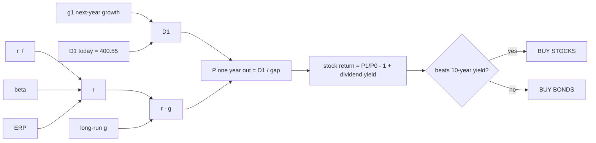

# Stocks or Bonds?

A one-page calculator that asks a single question: if you buy the S&P 500 today and hold it for a year, do you beat just buying the 10-year Treasury and collecting its yield?

**Live:** https://condortango.github.io/stocks-or-bonds/

The left side is locked to real market values, loaded from `data.json` and refreshed daily by a GitHub Action (see [Daily data refresh](#daily-data-refresh)). On the right, sliders let you set what you think those inputs will be a year from now. The page reprices the index with the Gordon growth model, adds dividends, and compares the result to the 10-year yield.

## The model

Two textbook formulas, chained together.

**CAPM** gives the return investors demand from stocks:

$$r = r_f + \beta \cdot ERP$$

**Gordon growth** turns that required return into a price:

$$P = \frac{D_1}{r - g}$$

Put them together:

$$P = \frac{D_1}{r_f + \beta \cdot ERP - g}$$

| Symbol | Meaning |
|---|---|
| $r_f$ | 10-year Treasury yield (the risk-free rate) |
| $\beta$ | beta, fixed at 1 for the index |
| $ERP$ | equity risk premium, the extra return demanded for holding stocks |
| $g$ | long-run earnings growth, assumed to last forever |
| $D_1$ | forward 12-month S&P 500 earnings per share |
| $r - g$ | the gap; a smaller gap means a higher price |

Earnings stand in for dividends. That's the usual shortcut when you price the whole index.

## What happens when you move a slider



## The core logic

This is the page's `calc()` function, trimmed to what matters:

```js
// today, locked
r0  = rf0 + beta0 * erp0            // 5.18 + 1 * 4.14 = 9.32%
P0  = D1_0 / (r0 - g0)              // 400.55 / (9.32% - 4.145%) = 7,740

// a year from now, from the sliders
D1  = D1_0 * (1 + g1)               // next year's earnings
r   = rf + beta * erp
if (r <= g) return "NO PRICE"       // Gordon breaks when g reaches r
P1  = D1 / (r - g)

stockReturn = (P1 / P0 - 1) + dividendYield
bondReturn  = rf0                   // hold the 10-year, collect its yield

verdict = stockReturn > bondReturn ? "BUY STOCKS" : "BUY BONDS"

// second line: is valuation (the multiple) helping or hurting?
multiple = (g - g0) > (r - r0) ? "helping" : "hurting"
```

## Two growth numbers, on purpose

There are two growth inputs, and they do different jobs.

1. **g₁ (next-year growth)** is a one-time step up in earnings. It raises $D_1$ and leaves the multiple alone. It starts at FactSet's 15.2% estimate for CY2027.
2. **g (long-run growth)** is Gordon's forever rate. It changes the multiple, and it has to stay below $r$.

If you typed 15.2% in as long-run g, then $r - g$ would go negative and the model would give no price. That's why the FactSet number goes into g₁ and not into g.

## The two tests in the banner

1. **The verdict** checks the total one-year return. It's stock price change plus dividend yield, measured against today's 10-year yield.
2. **The multiple test** compares Δg to Δr. When long-run growth rises by more than the required return, the $r - g$ gap narrows and valuation adds to the return. When it doesn't, valuation drags.

## Worked example with the defaults

These are the values from the Sep 25, 2026 snapshot. The live page uses whatever is in `data.json` today.

| | Today | 1 year out |
|---|---|---|
| r_f | 5.18% | 5.18% |
| β × ERP | 4.14% | 4.14% |
| r | 9.32% | 9.32% |
| g | 4.145% | 4.145% |
| r − g | 5.175% | 5.175% |
| D₁ | $400.55 | $461.43 (+15.2%) |
| P (S&P 500) | 7,740 | 8,917 |

The price return is +15.20%. Add the 1.05% dividend yield and stocks return +16.25%, against +5.18% for the 10-year. That's an 11.07-point edge, so the verdict is **BUY STOCKS**. The multiple test reads neutral because neither r nor g moved.

## Where today's numbers come from

All Today values are read from [`data.json`](data.json), which stores each value with its source and as-of date. The page loads it on open and falls back to the Sep 25, 2026 values embedded in `index.html` if it can't (for example when you open the file straight from disk). The values below are that Sep 25, 2026 snapshot.

| Input | Value | Source and date | Refresh |
|---|---|---|---|
| 10-year yield | 5.18% | US Treasury curve, Sep 24, 2026 close | Daily |
| ERP | 4.14% | Damodaran implied ERP, Sep 1, 2026 | Manual |
| β | 1.00 | By definition for the index | Manual |
| D₁ | $400.55 | FactSet forward P/E of 19.1 at S&P 7,650.50, Sep 18, 2026 | Derived (weekly P/E) |
| Dividend yield | 1.05% | multpl.com (S&P data), Sep 24, 2026 | Manual |
| S&P 500 | 7,740.28 | Sep 25, 2026, 11:10 AM PT | Daily |
| Long-run g | 4.145% | Backed out as r − D₁/P so today's model price matches the index | Derived (daily) |
| g₁ default | 15.2% | FactSet Earnings Insight, CY2027 EPS growth, Sep 18, 2026 | Weekly |

## Daily data refresh

A scheduled GitHub Action ([`.github/workflows/update-data.yml`](.github/workflows/update-data.yml)) runs [`scripts/update_data.py`](scripts/update_data.py), commits `data.json` only when a value changed, and then asks GitHub Pages to rebuild.

- **Schedule:** every day at 13:17 UTC, which is 6:17 AM PT in daylight time (5:17 AM PT in standard time). GitHub can start scheduled runs a few minutes late.
- **Daily:** the 10-year yield from the [US Treasury daily par yield curve](https://home.treasury.gov/resource-center/data-chart-center/interest-rates/TextView?type=daily_treasury_yield_curve), and the S&P 500 close from [FRED series SP500](https://fred.stlouisfed.org/series/SP500). Both are the prior trading day's close at run time.
- **Weekly:** the forward 12-month P/E, the S&P level it is quoted against, and next year's EPS growth (g₁ default) from FactSet's free [Earnings Insight](https://www.factset.com/earningsinsight) PDF, usually published on Fridays. The Friday report is picked up by Saturday's run.
- **Derived on every run:** D₁ = S&P level in the FactSet report / forward P/E, and g = r<sub>f</sub> + β × ERP − D₁/P.
- **Manual:** ERP, β and dividend yield. Edit their `value` and `as_of` in `data.json` and push.

If a source is down or a report can't be parsed, the script keeps the previous values and the run still succeeds with a warning in the log.

Run it by hand:

```sh
gh workflow run update-data.yml -R condortango/stocks-or-bonds
```

Or locally: `pip install pypdf && python scripts/update_data.py` (add `--dry-run` to only print the result).

## Limits

- The bond side assumes you hold the 10-year for a year and collect its yield. It ignores price changes on the bond.
- Gordon is very sensitive when $r - g$ is small. At today's gap of about 5.2 points, a 0.25-point move in r or g shifts the price by about 5%.
- The Today values are refreshed once a day, not live. ERP, β and dividend yield change only when someone edits `data.json`.

## Run it

It's one HTML file plus `data.json`, with no build step and nothing to install. Open `index.html` in a browser, or use the live link above. Opened from disk, the page shows the embedded Sep 25, 2026 values.

---

For education only. Not investment advice.
